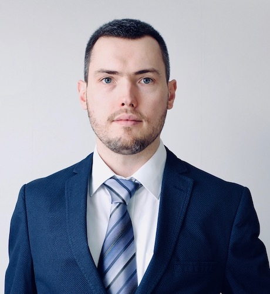

Профессионально работаю в информационных технологиях более 14 лет. Строю ИТ-системы работающие 24х7 круглосуточно, способные выдержать любую посещаемость и приносить бизнесу доход.
Богатый опыт работы с различными современными технологиями DevOps. В последнее время занимаюсь высоконагруженными веб проектами. Всегда стремлюсь достигать высокого качества в своей работе. Умею управлять командой и взаимодействовать с заказчиками.  Разрабатывал, внедрял и управлял различными технологическими решениями от Microsoft, Linux, Cisco и Juniper.
Слежу за новыми технологиями, изучаю их и постоянно думаю над совершенствованием текущей ИТ-системы. В работе стремлюсь достигать 100 процентного результата в рамках бюджета и в срок.

Увлекаюсь любительской фотографией архитектуры/природы/людей. Слежу за здоровьем и регулярно практикую цигун. Летом люблю выезжать в парки на велосипеде. А так же люблю посещать достопримечательности там, куда еду отдыхать.

